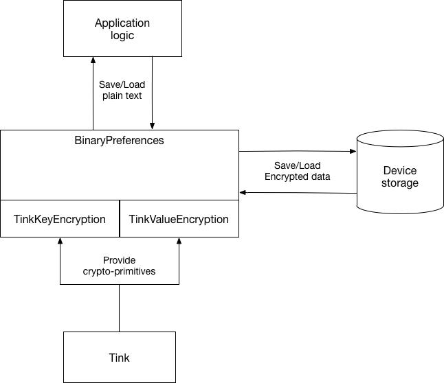

# Advanced Tink

Пример использования библиотеки [Tink](https://github.com/google/tink) вместе с библиотекой [BinaryPreferences](https://github.com/yandextaxitech/binaryprefs). Подключить ее можно следующим образом:

`implementation 'com.github.yandextaxitech:binaryprefs:1.0.0'`

### Зачем?
Комбинация этих двух библиотек, позволяет достаточно просто реализовать безопасное хранение пользовательских данных, даже на рутованных устройствах. Это возможно, потому что Tink хранит ключи в AndroidKeystore. С другой стороны, библиотека BinaryPreferences поддерживает бесшовное шифрование всех сохраняемых данных, так что вам даже не придется об этом задумываться.

### Как это работает


Чтобы объединить 2 библиотеки, были написаны альтернативные реализации шифрования с использованием Tink. Найти их можно в классах `TinkKeyEncryption` и `TinkValueEncryption`. Применение двух сразу не является обязательным и задается в настройках BinaryPreferences.

```kotlin
    val preferences by lazy {
        BinaryPreferencesBuilder(this)
            .keyEncryption(TinkKeyEncryption(this, daead))
            .valueEncryption(TinkValueEncryption(this, aead))
            .build()
    }
```

**Важный момент**: При AEAD шифровании, Tink каждый раз генерирует новый вектор инициализации, что на выходе дает **разный** шифротекст при каждом повторном шифровании. По этой причине, для шифрования ключей преференсов применяется т.н. "детерминированный AEAD", который всегда выдает стабильный шифротекст. Это является менее безопасным *в общем случае*, но вполне подходит для данной задачи.

### Для дальнейшего изучения

* [Работа с Tink из Java](https://github.com/google/tink/blob/master/docs/JAVA-HOWTO.md)
* [Описание всех доступных крипто-примитивов](https://github.com/google/tink/blob/master/docs/PRIMITIVES.md)
* [Что такое AEAD](https://en.wikipedia.org/wiki/Authenticated_encryption)

